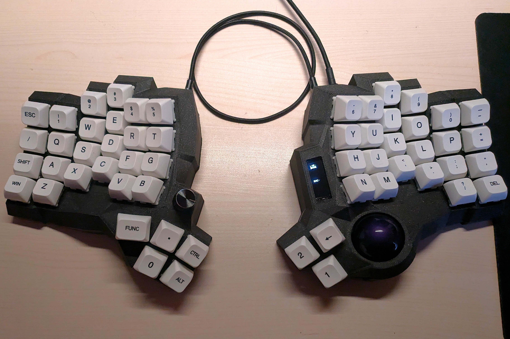



# Cosmicstone

Cosmicstone is my personal tailored split keyboard.
It is powered by the powerful QMK firmware.
Designed in Cosmos Keyboard Generator, inspired by Charybdis.

It features a split ergonomic design, a thumb-cluster trackball, a rotary encoder and an OLED screen.

Cosmicstone was born from the necessity of building a custom ergonomic split keeb, comfortable for my hand size, and my taste adapted to the Thinkpad Trackpoint.
Trackball functions are inherited from the Charybdis source and integrated in the keymap.

Every component was sourced on AliExpress, the case is fully 3D printed, hand-wired and built cheaply and conveniently.

### How to compile

1. Download QMK MSYS
2. In QMK MSYS run `qmk setup` and pull the keyboard database
3. Clone this repo in `/qmk_firmware/keyboards/`
4. Run `qmk compile -kb <keyboard> -km default`

